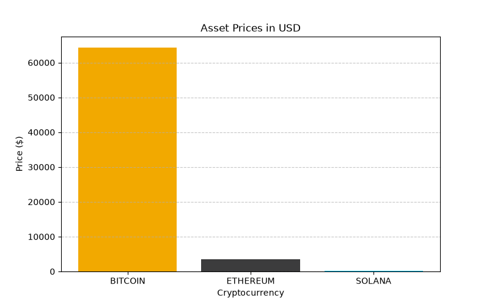

markdown
# Global Currency & Crypto Market Tracker

## Project Overview
This is a lightweight Python data pipeline designed to pull, clean, store, and visualize real-time cryptocurrency and fiat exchange data using public APIs. 

## Tech Stack
* **Language:** Python
* **Data Manipulation:** Pandas
* **Data Visualization:** Matplotlib
* **API Integration:** Requests API

## How It Works
1. Connects to the CoinGecko API to pull live asset valuations.
2. Leverages **Pandas** to clean JSON outputs and transform them into a tabular format.
3. Appends historical records into a localized `market_prices.csv` storage file.
4. Generates an automated bar chart (`price_chart.png`) mapping current asset values.

## Data Visualization

